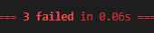
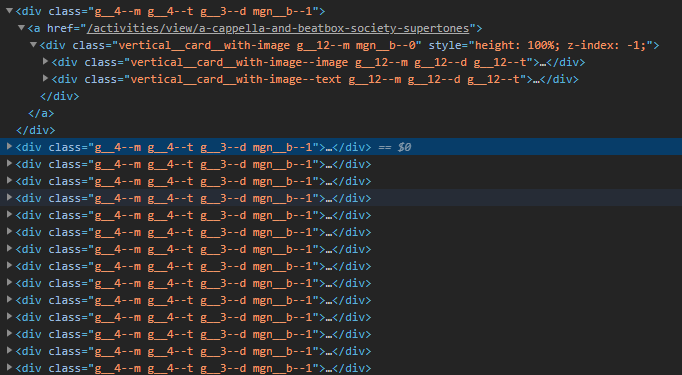
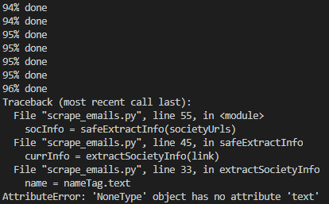
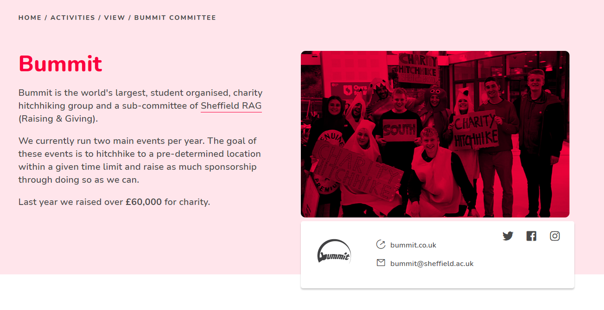

# Development Process

## Research

To begin with I know I want to output all my results into a CSV file so I know I'm going to want to write some code to manage outputting the list as a CSV. After a quick google I found a [library called csv](https://docs.python.org/3/library/csv.html) which manages the whole writing to a file thing for me. Next I need to work out how to actually get HTML off any site for my purposes I decided to go with the  [beautiful soup](https://realpython.com/beautiful-soup-web-scraper-python/) method because it looks easy to use.

## CSV Development

I wrote a quick bit of code to manage the IO with the CSV file and then unit tested the whole thing to make sure that it worked, last thing I want is to run the code and then it doesn't output the emails to my CSV so I have to wait for it to run again.

To finish this section of development up I made a blank csv file called email-list.csv and added some unit testing to it. Things like checking that specific societies existed and also that the number of societies in the list was roughly what was expected. These all failed for the moment but that's because it was testing a blank list.



## Planning To Scrape

Now that I have my IO sorted I need to work out how I'm going to find all the emails on the SU site, I know [this page](https://su.sheffield.ac.uk/activities/find-a-society) has a list of all the society pages but none of their emails. If I click on each of the links I can find the society's name and email so now I need to find a way to make my python script do that for me.

So I started poking around in the code of the website using the inspection tool and found that each society has a div dedicated to it that has a very specific class "g__4--m g__4--t g__3--d mgn__b--1" which I could only find in those sections of HTML.



Then I noticed that within each of those sections was an "a" tag which had the link to the society's specific page in the href attribute. This was all the information I'd need to get started on the scrape.

## Scraping the Links

So my first objective was to find all the links that went to each of the individual pages. Therefor I found all those "div" tags from before with that specific class. To do this you first get the page using the request library like so:

```python
page = requests.get(SOCIETY_LIST_URL)
```

Then parse the page using beautiful soup and use it's selector to get all those society specific tags.

```python
societiesSection = pageSoup.find('section', id="socListings")
societies = societiesSection.findAll(class_="g__4--m g__4--t g__3--d mgn__b--1")
```

And finally to pull each of the links out of those sections a simple for loop does the job.

```python
links = []
for society in societies:
    linkTag = society.find('a')
    link = linkTag['href']
    links.append(link)

return links
```

## More Planning

Now that I have a program that outputs a list that looks like this:

```
['/activities/view/a-cappella-and-beatbox-society-supertones', '/activities/view/academic-medicine-society', ...
```

I need to use those links to get me to each of the society pages. Given that these are relative links if we just take the first section of the su website (https://su.sheffield.ac.uk) and then append the path that each of those we should get a link that we can request a page from (https://su.sheffield.ac.uk/activities/view/a-cappella-and-beatbox-society-supertones)

Now I can get all the pages using the request library in a for loop I just need to work out how to get all the info from the page. Luckily again the tags related to this were relatively easy to identify using the chrome inspect tool. The title is in a "h2" tag and the class is "t__none f__b--eb" with the email in a "div" tag with another strange class "outlet__header--contact t__def-bl--pri contact__align mgn__t--1 mgn__b--1"

## Getting the Emails

Adding those selectors was easy enough so now my code should output all the the emails for the societies into the CSV. However this is actually what I got:



After a brief debugging process I found that the issue was with the Bummit society page. The format for this page is very different to all the other pages up to this point and as such it no longer has title or email sections that the selectors can latch onto. Here's a side by side of how different this page is the the others:




So to make sure that strange pages don't cause me any problems I'll add some checks:

```python
nameContainer = pageSoup.find('h2', class_="t__none f__b--eb")
name = ""
if nameContainer != None:
    name = nameContainer.text
```

All this code does is make sure that the section of the page I've tried to select exists and if it doesn't then the name is just left blank. I did the same thing for the email.

## Completion

After some tidy up the code now successfully gives me a CSV of all the societies names and their emails. Running the unit testing on the email list I get a pass on all tests meaning it's about what I was expecting.